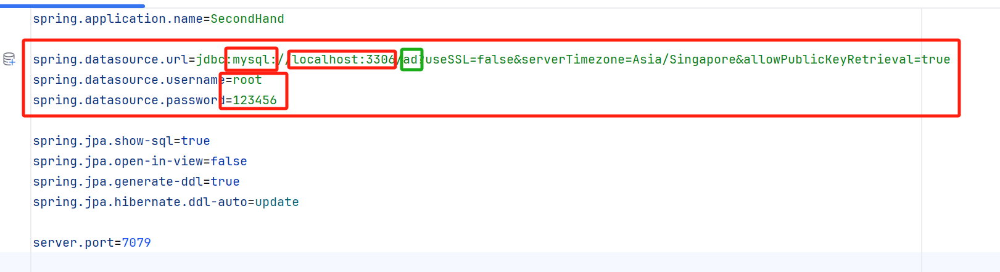
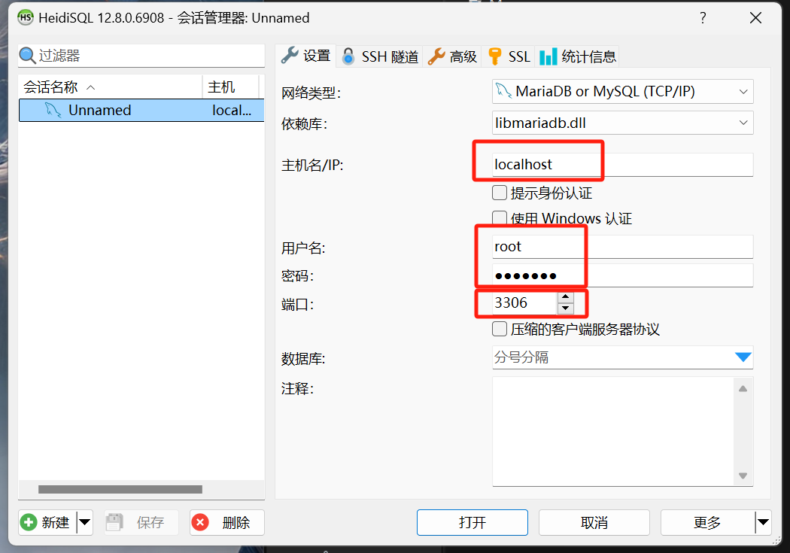
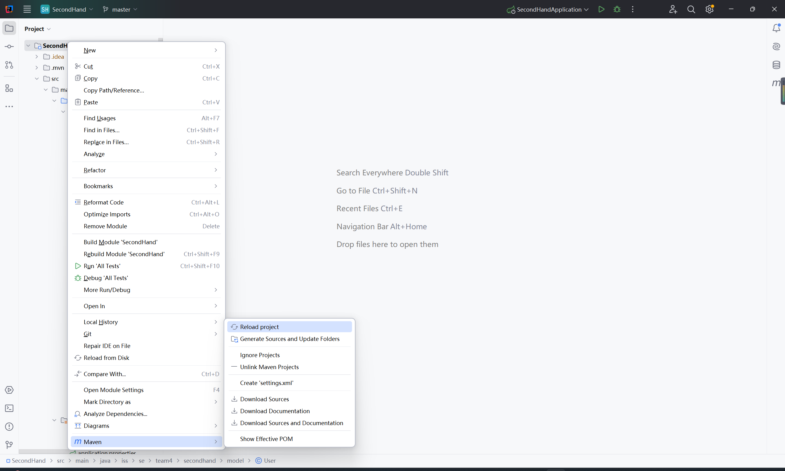
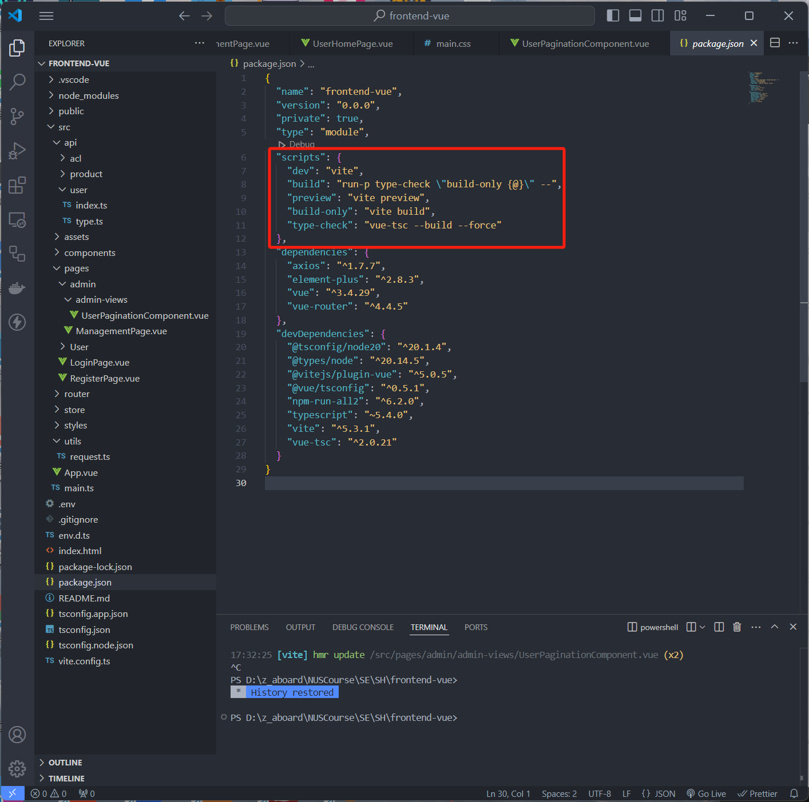

# Newest version is in Branch 'release'


# Installation Requirements

- **JDK 17**
- **Maven**
- **Node.js**
- **npm**

# Dependency Installation

## Database Connection

### application.properties



### HeidiSQL



Ensure that the information in the red box matches exactly:

- **IP**
- **Port**
- **Username** (usually `root`)
- **Password**

The name in the green box can be modified, but you must create a database with the same name in MySQL. When running the Java Spring Boot application, empty tables will be automatically created (due to JPA's ORM functionality).

# Backend Dependencies

## Maven



With the above configuration, Maven should automatically download dependencies to the local repository, so there is no need to download Maven separately.

# Frontend Setup

### Windows

Download Node.js: [https://nodejs.org/](https://nodejs.org/) (Remember to select the "Add to PATH" option)

### macOS

You can use Homebrew to install:

```bash
brew install node
```

Directly download via the command line: When you download Node.js, npm will also be included. Verify the installation:

```bash
node -v
npm -v
```

Install dependencies:

```bash
#Navigate to the frondend-vue folder
npm install
```

Run the application:

```bash
# Navigate to the frondend-vue folder
npm run dev
# If you prefer not to use 'dev', you can modify the command in the red box below
```

## CLI



That's all I can think of for now. If there are any issues, we can discuss further.

# Backend Structure Overview

## pom.xml - Project dependencies managed by Maven (currently includes)

- `springboot`: Spring Boot related
- `springboot-test`: Testing setup
- `JDBC`: Database connection
- `JPA`: ORM and persistence support

## application.properties

- Database connection settings
- Port configuration

## java Directory Structure

- **common**: Uses generics to handle response data uniformly and simplify operations
- **config**: Configuration classes used for injecting Bean factories (IOC container) and handling CORS issues
- **controller**: Presentation layer (corresponding to use cases), handles frontend requests
- **service**: Service layer (business logic)
  - `Impl`: Concrete implementations
  - `service`: Defines interfaces
- **repository**: Data persistence layer
- **model**: DAO (in JPA, entities can directly correspond to database tables)

# Frontend Structure Overview

- **node_modules**: Project dependencies
- **public & src**: Project content

## Inside src

- **App.vue**: Main component
- **main.ts**: Main entry file
- **Folders**
  - `api`: API interface (the folder is categorized, type.ts defines data structures, and index.ts contains request methods)
  - `assets`: Static resources
  - `components`: Components (small, reusable components that can be used across different views)
  - `pages`: View components (major interfaces that can be routed)
  - `router`: Routing configuration (handles page navigation logic)
  - `store`: State management
  - `styles`: Stylesheets
  - `utils`: Utility functions (currently includes an axios wrapper)

## Configuration Files

- **env.d.ts** Defines types for environment variables in TypeScript
- **index.html**: Entry file for the project
- **package.json & package-lock.json**: npm-managed project dependencies
- **tsconfig.app.json** TypeScript compiler configuration file for the application
- **tsconfig.json** Defines global TypeScript compiler configuration
- **tsconfig.node.json** TypeScript compiler configuration specific to the Node.js environment
- **vite.config.ts**: Vite configuration file (can be replaced with webpack)

# Database Overview

- **MySQL**
- **HeidiSQL** Database client tool

```

```
